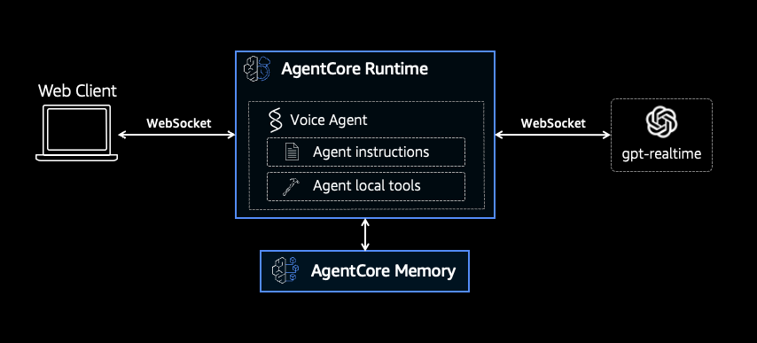
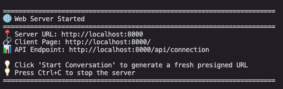
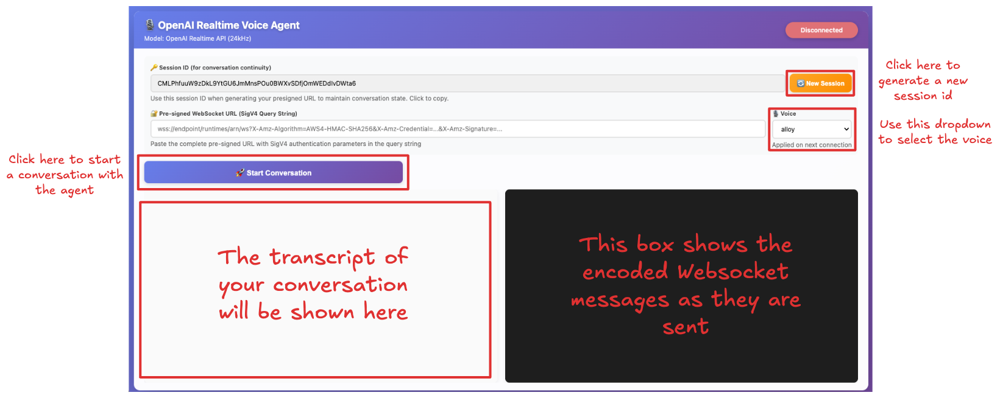

# Hosting Memory-Enabled Strands Agents with OpenAI models in Amazon Bedrock AgentCore Runtime

## Overview

In this tutorial we will learn how to build and host a memory-enabled voice agent with Amazon Bedrock AgentCore runtime. The agent we will build in this tutorial has a calculator in its tool set, and its integration with Amazon Bedrock AgentCore memory gives the agent the possibility of remembering details from previous conversation over the same session. 

We will focus on a [Strands Bidi Agent](https://strandsagents.com/latest/documentation/docs/user-guide/concepts/bidirectional-streaming/agent/), and we will use [OpenAI GPT Realtime](https://developers.openai.com/api/docs/guides/realtime) as voice model.


### Tutorial details

| Information         | Details                                                                  |
|:--------------------|:-------------------------------------------------------------------------|
| Tutorial type       | Conversational                                                           |
| Agent type          | Single                                                                   |
| Agentic Framework   | Strands Agents                                                           |
| LLM model           | OpenaAI GPT Realtime                                                     |
| Tutorial components | AgentCore Runtime, AgentCore Memory, Strands Agent, OpenAI Realtime      |
| Tutorial vertical   | Cross-vertical                                                           |
| Example complexity  | Medium                                                                   |
| SDK used            | Amazon Bedrock AgentCore Python SDK, Strands Python SDK and boto3        |

### Tutorial Architecture

In this tutorial we will describe how to deploy a memory-enabled voice agent to AgentCore runtime. 

For demonstration purposes, we will  use a Strands Agent using OpenAI Realtime API.

In our example we will use a very simple agent with a calculator tool so that users can ask the agent to perform calculations. 


<div style="text-align:center">
    
</div>


### Tutorial key Features

* Hosting Agents on Amazon Bedrock AgentCore Runtime
* Ingegrate a Strands Agent with Amazon Bedrock AgentCore Memory
* Using OpenAI Realtime Models
* Using Strands Agents

## Prerequisites
* AWS CLI configured with appropriate permissions
* Python 3.12+
* Docker (for building custom agent images)

## Tutorial Structure and Walkthrough
This tutorial makes use of various AWS maintained Python SDK, and as such we recommend the user to run from a virtual environment for dependency isolation. You can create a Python virtual environment from your terminal with 

```
python -m venv .venv-openai-realtime    
```
and activate it.

**macOS / Linux:**
```bash
source .venv-openai-realtime/bin/activate
```

**Windows:**
```bash
.venv-openai-realtime\Scripts\activate
```

Once the virtual environment is active, you should see `(.venv-openai-realtime)` prefixed in your terminal prompt. You can then install all required dependencies with:

```bash
pip install -r requirements.txt
```

This will install the following packages:

| Package | Purpose |
|:--------|:--------|
| `boto3` | AWS SDK for Python |
| `ipykernel` | Jupyter notebook kernel support |
| `dotenv` | Load environment variables from `.env` files |
| `bedrock-agentcore` | Amazon Bedrock AgentCore SDK |

The project is structured as follows:
* `/agent` - this folder contains all the necessary files to deploy the voice agent in agentcore.
* `/client` - this folder contains an implementation of a webclient which has been built to communicated with the voice agent over a WebSocket channel.

### Deploy the Voice Agent
The Voice Agents connects to OpenAI [gpt-realtime](https://developers.openai.com/api/docs/models/gpt-realtime) via OpenAI Realtime APIs, and as such is available with an OpenAI API-enabled account. Please notice that this is a paid account, and running this tutorial will incur in some charges with OpenAI (see API pricing in [gpt-realtime](https://developers.openai.com/api/docs/models/gpt-realtime)). 

Follow these steps:

1- Create an OpenAI API key and store it in a `.env` file in the root folder in the following format 
```
OPENAI_API_KEY=<YOUR_OPENAI_KEY>
```
Notice this is not the recommended way of handling secrets in your AWS enviroment, but we will copy the API key locally for simplicity in this tutorial. We suggest you deactivate the API key immediately after executing this tutorial.

2- Open and run the Jupyter Notebook [agent-deployment.ipynb](agent/agent-deployment.ipynb) in your favourite Jupyter environment, and carry out the listed steps. The notebook contains a `Cleanup` section which you can use to delete the AWS resources created during this tutorial. We recommend to execute the `Cleanup` section after you are finished with the tutorial.


### Chat with the Agent

Executing the `Create the Agent` section in [agent-deployment.ipynb](agent/agent-deployment.ipynb) will output the agent `ARN` which you can use with the local websocket client. To start the client move to the `client/` folder and run this in your terminal

```
 python client/client.py --runtime-arn <AGENTCORE_RUNTIME_ARN> --no-browser
```
replacing the `<AGENTCORE_RUNTIME_ARN>` with the output of your Jupiter notebook. This will start a local server and output


<div style="text-align:center">
    
</div>


You can now open your favourite browser and connect to `http://localhost:8000`. Notice to be able able to chat with your voice agent both sound output and sound capture via microphone need to be enabled for your browser. You will be presented with the following interface which you can use to chat with your agent.


<div style="text-align:left">
    
</div>


The agent has been specifically prompted to remember your chat history (up to 50 previous messages) within conversations with the same session ID. You can test this by having an initial conversation with your agent and e.g. telling it your name, or asking it to perform some calculation and disconnecting the chat. If you reconnect with the same session ID the agent will address you by name, and you can ask it questions about your previous conversation. You can generate a new session ID to test the session-based segregation of your Agent Memory.


## (Optional) Cleanup
* Delete the `.env` file, and deactivate your OpenAI API key.
* Execute the cells in the `Cleanup` section in [agent-deployment.ipynb](agent/agent-deployment.ipynb)


